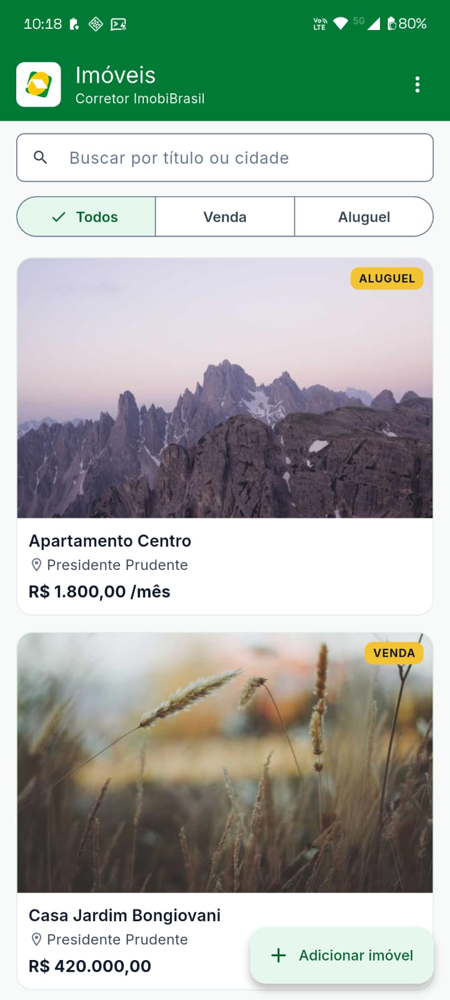
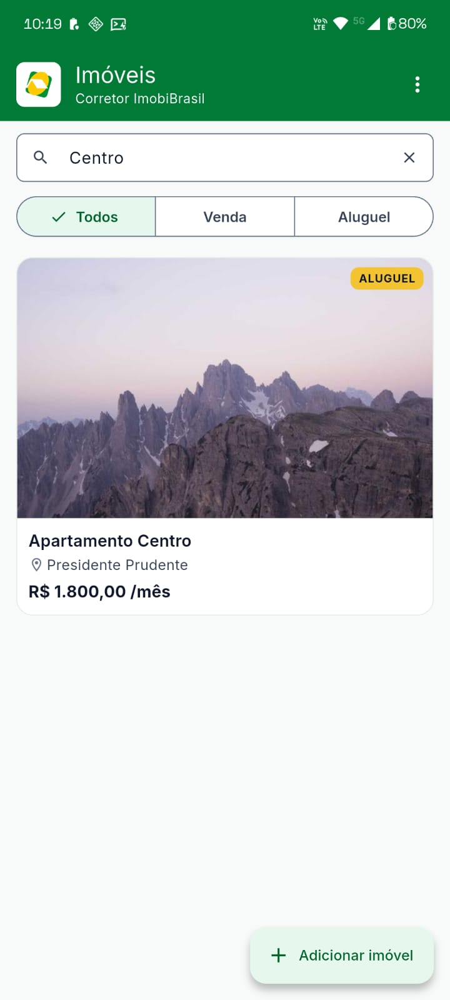
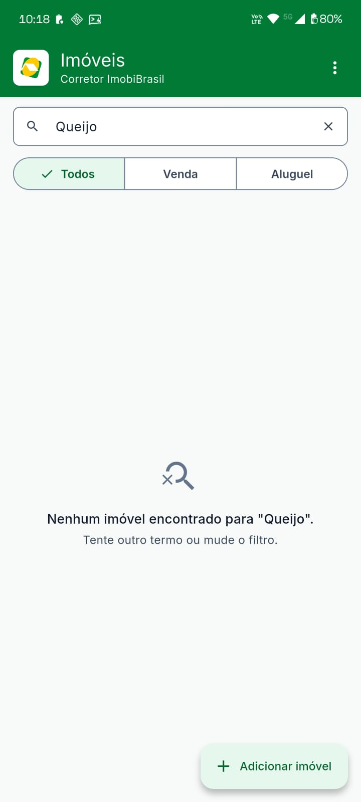
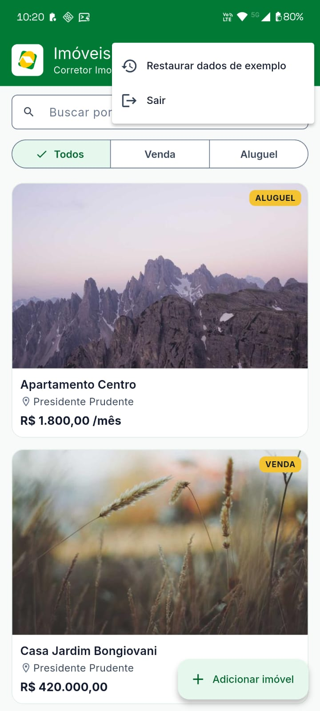
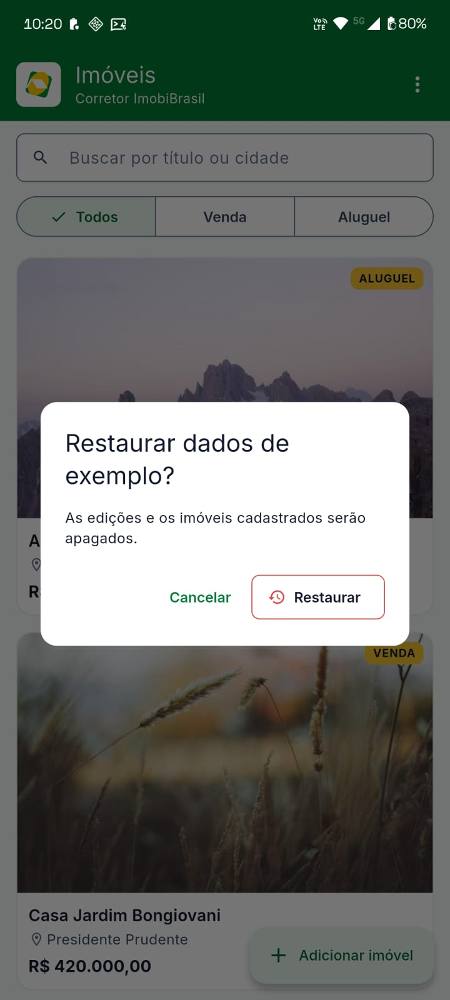
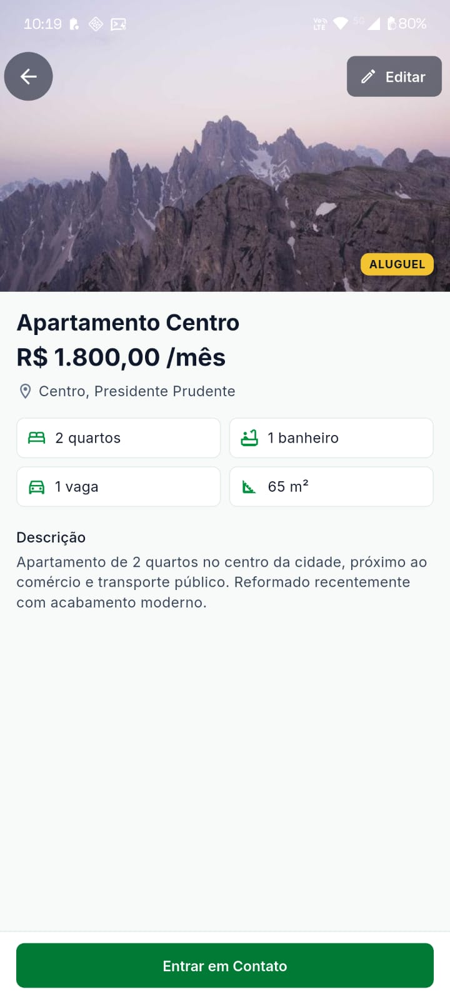
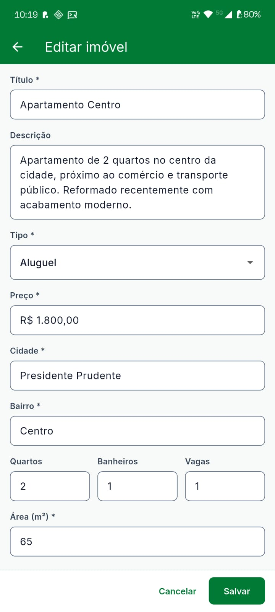
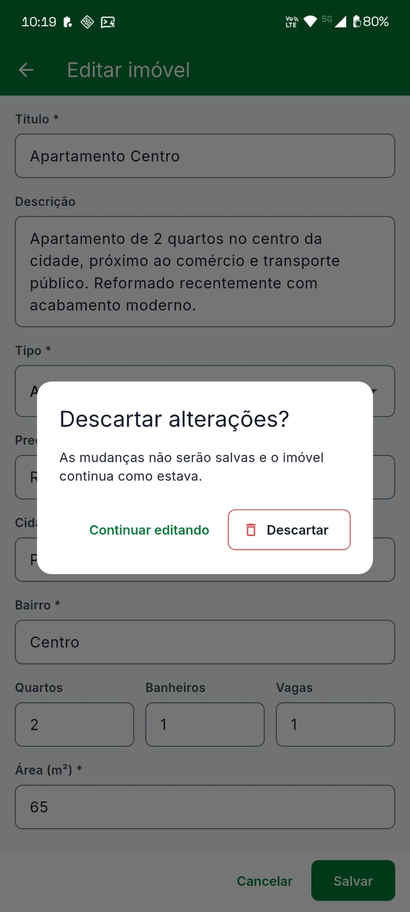
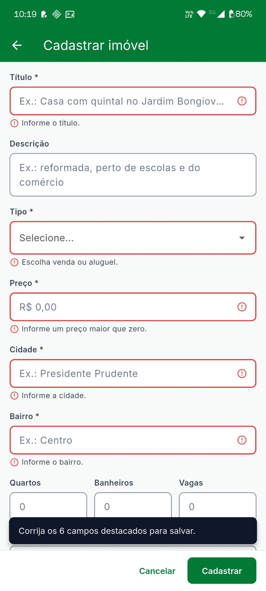
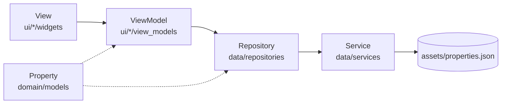

# ImobiBrasil: Imóveis

Aplicativo Flutter de **listagem, detalhe, edição e cadastro de imóveis, com login**, feito como teste técnico para a vaga de Desenvolvedor Flutter Pleno. Segue a identidade visual da ImobiBrasil e consome um JSON simulado como se fosse uma API.

## Plataforma alvo

**Android**, testado em celular real via cabo USB. Como o código é o mesmo, o app também roda no **navegador (Flutter Web)**, usado no desenvolvimento e declarado aqui como segunda plataforma. Layout pensado para celular (*mobile first*).

## Como rodar

**Versões:** Flutter **3.47.5** (canal *stable*), com Dart **3.13.4** (`sdk: ^3.13.4` no `pubspec.yaml`).

**Pré-requisitos:** para o Android, o *Android SDK* (kit de desenvolvimento) e um aparelho com **Android 7.0 ou superior** (ou um emulador); para o navegador, o Chrome. O comando `flutter doctor` confere se o ambiente está pronto.

```bash
git clone https://github.com/itsmecamila/imobi_brasil_app.git
cd imobi_brasil_app
flutter pub get
```

| Plataforma | Comando |
|---|---|
| **Android** (celular com depuração USB ligada, ou emulador) | `flutter run` |
| **Navegador** | `flutter run -d chrome` |
| **APK** de instalação (arquivo em `build/app/outputs/flutter-apk/app-release.apk`) | `flutter build apk --release` |

Com mais de um aparelho conectado, o Flutter pergunta qual usar: `flutter devices` lista as opções e `flutter run -d <id>` escolhe uma. O APK é assinado com a chave de testes do Flutter: serve para instalar e testar, não para publicar numa loja.

**Fotos:** vêm da internet (`picsum.photos`). Sem rede, os cards mostram "Foto indisponível"; o restante do app funciona normalmente, porque os dados são locais.

**Credenciais de teste** (validadas localmente, sem servidor):

| E-mail | Senha |
|---|---|
| `corretor@imobibrasil.com.br` | `imobi2026` |

A sessão fica guardada no aparelho: ao reabrir o app, ele vai direto para a Lista (até tocar em **Sair**).

**Ver os estados de erro:** o login, o carregamento e o salvamento podem falhar de propósito:

```bash
flutter run --dart-define=SIMULATE_ERROR=true
```

**Qualidade:**

```bash
flutter analyze   # análise estática, sem avisos
flutter test      # 134 testes automatizados
```

## O que o app faz

| Tela | Funcionalidades |
|---|---|
| **Splash** | Logo da ImobiBrasil por 2 s ao abrir (na Web, um logo em HTML cobre o carregamento do Flutter) |
| **Login** (extra) | E-mail e senha com validação · 👁 para mostrar a senha · "Entrando…" · "E-mail ou senha incorretos." sem dizer qual dos dois (para não revelar quais e-mails existem) · sem login, qualquer endereço leva a esta tela |
| **Lista** | Nome do usuário na barra e menu **⋮** com **Restaurar dados de exemplo** e **Sair** (os dois pedem confirmação) · cards com foto, título, cidade, preço e tipo · busca por título ou cidade (ignora maiúsculas e acentos) · filtro Todos / Venda / Aluguel · barra, busca e filtro somem ao descer e voltam ao subir (*quick return*) · carregando com **esqueleto animado** (*shimmer*) no formato dos cards, vazio e erro com **Atualizar** |
| **Detalhe** | Foto que encolhe e vira a barra verde ao rolar · toque na foto abre **em tela cheia com zoom** (a foto "voa" do card até lá, com animação Hero) · título, preço em R$, bairro e cidade · quartos, banheiros, vagas e área · botão **Entrar em Contato** (painel de baixo no celular, diálogo em tela larga) com WhatsApp, ligação e e-mail · estado "imóvel não encontrado" |
| **Edição** | Formulário em uma coluna · máscara de preço em reais · validação ao sair de cada campo (obrigatórios; preço e área maiores que zero) · aviso com a contagem de campos a corrigir ao tentar salvar · "Salvando…" · SnackBar de confirmação · **Cancelar**, a seta ← e o voltar do Android, com mudanças, perguntam "Descartar alterações?" (sem mudanças, saem direto) |
| **Cadastro** (extra) | Botão flutuante **＋ Adicionar imóvel** na Lista · mesmo formulário e validações da edição, com o tipo começando em "Selecione…" · "Cadastrando…" · o imóvel novo aparece no **topo** da Lista; se a busca ou o filtro o esconderiam, eles são limpos e o aviso explica por quê · **Cancelar** (ou voltar) com algo preenchido pergunta "Descartar cadastro?" |

Edições e cadastros aparecem na Lista e no Detalhe na hora e **ficam guardados no aparelho**: sobrevivem a fechar o app. Para recomeçar do zero, use **⋮ → Restaurar dados de exemplo**. Os dados do corretor são **de exemplo** (o telefone é inválido de propósito).

Documentos de apoio: [fluxo de navegação](docs/navegacao.md) · [estados de cada tela](docs/estados.md) · [identidade visual e contraste](docs/identidade-visual.md).

### Telas

Capturas no Android (Moto G), na ordem de uso.

<table>
  <tr>
    <td align="center" valign="top" width="33%"><br><b>Splash</b><br><sub>Logo completo da ImobiBrasil por 2 s ao abrir.</sub></td>
    <td align="center" valign="top" width="33%"><br><b>Login</b><br><sub>Rótulos sempre visíveis acima dos campos e exemplos de preenchimento dentro deles.</sub></td>
    <td align="center" valign="top" width="33%"><br><b>Login: validação</b><br><sub>Campos obrigatórios em branco: borda vermelha, ⚠ e a mensagem dizendo o que fazer.</sub></td>
  </tr>
  <tr>
    <td align="center" valign="top" width="33%"><br><b>Login: entrando</b><br><sub>"Entrando…" com indicador e botão desativado, evitando dois envios.</sub></td>
    <td align="center" valign="top" width="33%"><br><b>Lista</b><br><sub>Nome do usuário na barra, busca, filtro por tipo, cards com foto em cima e o botão de cadastro.</sub></td>
    <td align="center" valign="top" width="33%"><br><b>Lista: busca</b><br><sub>Busca por título ou cidade, sem diferenciar maiúsculas e acentos; ✕ limpa a busca.</sub></td>
  </tr>
  <tr>
    <td align="center" valign="top" width="33%"><br><b>Lista: sem resultado</b><br><sub>Estado vazio que diz o termo buscado e o que fazer em seguida.</sub></td>
    <td align="center" valign="top" width="33%"><br><b>Lista: menu ⋮</b><br><sub>Ações de pouco uso com rótulo visível: restaurar os dados de exemplo e sair.</sub></td>
    <td align="center" valign="top" width="33%"><br><b>Restaurar dados de exemplo</b><br><sub>Ação que apaga dados pede confirmação, com o botão destrutivo em contorno vermelho.</sub></td>
  </tr>
  <tr>
    <td align="center" valign="top" width="33%"><br><b>Detalhe</b><br><sub>Foto no topo, preço em reais (com "/mês" no aluguel), endereço, características em grade 2×2 e contato fixo no rodapé.</sub></td>
    <td align="center" valign="top" width="33%"><br><b>Foto em tela cheia</b><br><sub>Toque na foto: ela "voa" até aqui (animação Hero), com zoom de pinça; ✕ fecha.</sub></td>
    <td align="center" valign="top" width="33%"><br><b>Contato</b><br><sub>Painel de baixo com WhatsApp, ligação e e-mail do corretor (dados de exemplo).</sub></td>
  </tr>
  <tr>
    <td align="center" valign="top" width="33%"><br><b>Edição</b><br><sub>Formulário em uma coluna, preço com máscara em reais e Cancelar/Salvar fixos no rodapé.</sub></td>
    <td align="center" valign="top" width="33%"><br><b>Edição: descartar</b><br><sub>Sair com mudanças não salvas pede confirmação e explica a consequência.</sub></td>
    <td align="center" valign="top" width="33%"><br><b>Cadastro: validação</b><br><sub>Tipo sem escolha inicial; ao tentar cadastrar, cada campo mostra o erro e um aviso conta quantos corrigir.</sub></td>
  </tr>
</table>

### Design

As telas do MVP foram desenhadas em alta fidelidade e aprovadas **antes do código**: [`docs/wireframes.html`](docs/wireframes.html) (baixe o arquivo e abra no navegador; o GitHub mostra só o código). Os extras foram desenhados depois, em wireframes de texto, também antes de programar. O que mudou desde a versão aprovada:

| Na alta fidelidade (01/10) | No app | Origem |
|---|---|---|
| Sem login | Tela de login, nome na barra e menu ⋮ | Extra |
| Sem cadastro | Botão "＋ Adicionar imóvel" e tela de cadastro | Extra |
| Carregando com indicador girando | Esqueleto animado (*shimmer*) | Extra |
| Foto do detalhe só recolhe | Toque abre em tela cheia com zoom (Hero) | Extra |
| Barra da Lista baixa, de altura fixa | Barra mais alta, que cresce com a fonte do sistema | Teste no celular |
| Editar só com o ícone de lápis | Botão "Editar" com texto | Revisão da alta fidelidade |
| "Área" com sufixo "m²" dentro do campo | Rótulo "Área (m²)" | Falha de acessibilidade achada por teste |
| Campos sem exemplos | Exemplo de preenchimento em cada campo | Teste no celular |
| Cancelar descartava direto | Com algo modificado ou preenchido, confirma antes ("Continuar editando" · "Descartar") | Decisão revista: um toque por engano não pode apagar o que foi digitado |

## Decisões técnicas

| Tema | Escolha | Por quê |
|---|---|---|
| **Gerenciamento de estado** | **Provider** com `ChangeNotifier` nos ViewModels | Cada tela tem um ViewModel que é um `ChangeNotifier` (estado e ações); o Provider o entrega aos widgets e reconstrói as telas que o observam. É o mecanismo mais simples que cobre o projeto, com menos conceitos novos para aprender no prazo. Riverpod e BLoC foram estudados e comparados; o `AsyncValue` do Riverpod traria carregando/erro prontos, mas aqui esses estados são campos do ViewModel |
| **Arquitetura** | Guia oficial de arquitetura do Flutter (MVVM, *Model-View-ViewModel*): View → ViewModel → Repository → Service | Documentação oficial como referência; camada de domínio extra (Clean Architecture) seria cerimônia demais para o tamanho do app |
| **Navegação** | `go_router`, com rotas por endereço | `/login`, `/`, `/property/:id`, `/property/:id/edit`, `/property/:id/photo`, `/property/new`; trata o link direto e o "imóvel não encontrado". Um único `redirect` protege as rotas, e o roteador escuta a sessão: entrar e sair navegam sozinhos, de qualquer tela |
| **Dados** | JSON em `assets/` como dados de exemplo + `shared_preferences` no papel do banco do "servidor"; atraso de 1,5 s ao carregar e 1 s ao salvar | Simula a API sem servidor; o erro é simulável. O Service isola a fonte: guardar e ler do aparelho entrou **só no Service**, sem mudar Repository, ViewModels ou telas — o mesmo valeria para uma API real |
| **Salvamento** | Atualização **pessimista**: salva primeiro e só então muda a lista | Se falhar, a lista não muda e o usuário continua na edição com o que digitou |
| **Idioma** | Código em inglês; interface em português | A tradução das chaves do JSON (`titulo` → `title`) acontece só no modelo |
| **Tema** | `ThemeData` único com os *tokens* da marca; fonte Inter embutida | Nenhuma cor fora do tema; a fonte não depende de internet |

### Camadas

O teste pede, no mínimo, UI, lógica de negócio e acesso a dados. Elas ficam assim:

| Camada | Responsabilidade | Pasta |
|---|---|---|
| **UI** | Desenhar e repassar toques; sem regra de negócio | `lib/ui/<tela>/widgets/`, `lib/ui/core/` |
| **Lógica de negócio** | Estado da tela, busca, filtro, validação, "tem mudanças?", salvar | `lib/ui/<tela>/view_models/`, `lib/utils/` |
| **Acesso a dados** | Buscar o JSON, guardar a lista oficial e a sessão, e avisar as telas | `lib/data/services/`, `lib/data/repositories/` |
| **Modelo** | O que é um imóvel e um usuário (compartilhados), e a tradução do JSON para eles | `lib/domain/models/` |

Seguindo o guia oficial, o ViewModel fica junto da tela, dentro de `ui/`. A regra de negócio está nele; os widgets só desenham e repassam os toques.



**Injeção de dependências:** o `main.dart` cria os dois Repositories antes de abrir o app (o roteador escuta a sessão, e a carga dos imóveis começa antes do primeiro quadro); o `Provider` os entrega às telas, junto com os ViewModels; o Repository recebe o Service pelo construtor, e o ViewModel do Detalhe recebe a função que abre links. Por isso os testes trocam cada peça por uma versão falsa.

```
lib/
├── config/            dados de exemplo do corretor
├── data/
│   ├── repositories/  PropertyRepository e AuthRepository: fontes da verdade, ChangeNotifier
│   └── services/      PropertyService e AuthService: asset e credenciais fixas, atraso e erro simulados
├── domain/models/     Property (fromJson / toJson) e User
├── routing/           rotas do go_router
├── ui/
│   ├── core/          tema (cores, fonte) e widgets compartilhados
│   ├── login/ · property_list/ · property_detail/ · property_edit/ · splash/
│   ├── property_create/  cadastro (extra)
│   ├── property_form/    formulário compartilhado pela edição e pelo cadastro
│   └── property_photo/   foto em tela cheia
└── utils/             formatadores (R$, m², contagens) e máscara de preço
```

## Pacotes

| Pacote | Para quê |
|---|---|
| `provider` | Entregar o estado e as dependências às telas |
| `go_router` | Rotas por endereço, link direto e navegação aninhada |
| `intl` | Formatação em reais e números no padrão brasileiro |
| `flutter_svg` | Logo e ícone oficiais (SVG) |
| `url_launcher` | Abrir WhatsApp, discador e e-mail |
| `flutter_localizations` | Textos do Material em português |
| `shared_preferences` | Guardar imóveis e sessão no aparelho (no navegador, na Web) |
| `flutter_lints` | Regras de análise estática |

## Testes

**134 testes automatizados**, em 24 arquivos, cobrindo as três camadas da arquitetura e os caminhos entre as telas. Todos rodam com `flutter test` e no CI a cada envio.

| Tipo | Quantos | O que monta | Onde ficam |
|---|---|---|---|
| **Unidade** | **88** | Uma peça sozinha, sem tela: modelo, Services, Repositories, ViewModels, formatadores | `test/data/`, `test/domain/`, `test/utils/` e as pastas `view_models/` |
| **Widget** | **32** | Uma tela ou um componente, numa tela virtual: o teste toca, digita e lê o que aparece | `test/ui/**/widgets/`, `test/ui/core/`, `test/ui/splash/` |
| **Navegação** | **14** | O app com o roteador de verdade, passando por várias telas | `test/routing/` e `test/app_start_test.dart` |

No Flutter, testes de widget e de navegação usam a mesma ferramenta (`testWidgets`); a diferença é o tamanho do que montam.

### O que cada tipo garante

**Unidade (88)**
- **Dados:** o JSON vira imóvel e volta igual; com erro ao salvar ou cadastrar, **a lista não muda**; duas cargas ao mesmo tempo viram uma só requisição; edições, cadastros e sessão **sobrevivem a "reabrir o app"**; restaurar com erro não apaga o que estava guardado; sessão guardada ilegível pede o login de novo.
- **Login:** credencial errada × falha de conexão dão mensagens diferentes; e-mail ignora maiúsculas e espaços, senha não.
- **ViewModels:** busca sem acento e por cidade; filtro; o `reveal` limpa busca e filtro só quando escondem o imóvel novo; "tem mudanças?" de cada imóvel de exemplo; estados de carregando e erro.
- **Regras e formatos:** validações de todos os campos; máscara de preço (incluindo apagar até o fim); área com milhar (2000 m²) ida e volta.

**Widget (32)**
- **Layout em condições difíceis:** filtro "Aluguel" inteiro em telas de 320 e 360 de largura e com a fonte do sistema ampliada até 1,5×; cabeçalho que cresce com a fonte sem invadir a lista; barra de botões do formulário cabendo com "Cadastrando…". Esses testes carregam a fonte **Inter real**, porque a fonte padrão dos testes mede diferente.
- **Acessibilidade:** o 👁 da senha é anunciado como botão separado do campo; o esqueleto de carregamento fica parado com "remover animações" ligado e anuncia "Carregando imóveis…".
- **Formulários:** em branco, aponta os 6 obrigatórios e conta quantos corrigir; erro ao salvar mostra "Atualizar"; Cancelar com algo preenchido pede confirmação e "Continuar" mantém o que foi digitado.
- **Componentes:** card do imóvel, splash, menu ⋮ com Restaurar, botão de cadastro que só aparece com a lista carregada.

**Navegação (14)**
- Lista → Detalhe → foto em tela cheia **do tamanho da tela** → fechar.
- Lista → Cadastro → Lista, mantendo ou limpando a busca e o filtro.
- Sem login, o app e qualquer link direto caem no Login; entrar leva à Lista com o nome na barra; Sair pede confirmação e volta ao Login.
- Link direto para Detalhe, Edição, Cadastro ou foto **sem conexão**: mostra o erro com **Atualizar**, que resolve.
- O app ligado **exatamente como o `main`**, do login à lista.

### Como os testes foram feitos

- **Peças falsas no lugar das reais:** como cada peça recebe as dependências de fora, os testes usam Services que falham quando o teste quer, armazenamento em memória no lugar do celular e uma função falsa no lugar de abrir o WhatsApp.
- **Todo teste novo foi provado:** a correção era desfeita de propósito para confirmar que o teste acusava o defeito. Num caso, o teste passava mesmo com o defeito e foi reescrito.
- **Cada bug real virou teste:** a área de 2000 m², o "L" cortado, a foto em miniatura, a lista travada no carregamento e o sufixo que quebrava a acessibilidade têm, cada um, um teste que falhava antes da correção.
- **O que os testes não cobrem:** não há testes de integração no aparelho (`integration_test`); o comportamento no celular real foi verificado à mão, com roteiros por etapa, em dois aparelhos Android.

Para rodar só um grupo: `flutter test test/routing` (navegação), `flutter test test/data` (dados) ou `flutter test test/ui` (telas e ViewModels).

## Extras

| Extra | Situação |
|---|---|
| Mais de uma plataforma | ✅ Android e Web |
| Testes automatizados | ✅ Unitários, de widget e de navegação |
| Animações | ✅ Hero (lista → detalhe → foto em tela cheia) e *shimmer* no carregando da Lista (respeita "remover animações" do sistema) |
| Cadastro de imóvel | ✅ Botão flutuante na Lista; mesmo formulário e regras da edição; o novo aparece no topo |
| CI (GitHub Actions) | ✅ A cada envio: formatação, análise estática e os testes, com a mesma versão do Flutter |
| Login | ✅ Credenciais fixas, nome do usuário na barra, sair, rotas protegidas |
| Persistência local | ✅ `shared_preferences`: edições, cadastros e sessão sobrevivem a fechar o app; **Restaurar dados de exemplo** no menu |
| Firebase | ⬜ Não implementado |

## Próximos passos

O que eu faria a seguir. As duas primeiras são ideias que tive ao longo do projeto; as outras completam os extras do enunciado e o que ficou de fora do MVP.

- **CEP com API externa** (ex.: ViaCEP): ao digitar o CEP no cadastro ou na edição, preencher e validar cidade e bairro. Entraria como um Service novo, do mesmo jeito que o de imóveis, sem mudar as telas além do campo.
- **Fotos escolhidas pelo usuário**: escolher da galeria no cadastro e na edição, **várias fotos por imóvel** (galeria no detalhe e na tela cheia), **trocar** e **excluir** fotos. Hoje o imóvel novo recebe uma foto provisória.
- **Firebase** (Analytics e Crashlytics).
- Com uma **API real**: rolagem infinita sobre a lista, que já usa construção sob demanda.

## Harness e estratégia

Esse foi meu primeiro projeto com Flutter e Claude. Meu objetivo consistiu em usar o agente como aliado sem terceirizar as decisões nem o aprendizado. Organizei os recursos do Claude e o configurei para justamente atender esse objetivo.

### Ferramentas e agentes: o que usei e para quê

- **Claude Code no terminal** (modelo Opus 5.5; Sonnet 5.5 por um período, para poupar o limite de uso). Um agente principal durante todo o projeto e um **agente separado só para a revisão final de código** (`/code-review`).
- **`CLAUDE.md`** com papéis e regras de colaboração: explicar antes de fazer, passos pequenos, perguntas de checagem de entendimento ao fim de cada passo, fontes oficiais citadas, guarda de escopo e nada de abreviações.
- **Bloqueio de `git commit` e `git push`** para o agente, em `.claude/settings.json`: a instrução orienta, o bloqueio garante. Todos os commits foram feitos por mim, depois de revisar o `git diff --staged`.
- **Hooks**: um formata e analisa cada arquivo Dart logo depois que o agente o edita (pegou na hora imports faltando e um método obsoleto); outro guarda a conversa numa versão legível, base do meu diário.
- **Skills** com as minhas regras de UX (heurísticas de Nielsen, Material 3, acessibilidade) e de uso da identidade visual (tokens e contraste), carregadas antes de qualquer trabalho de interface.
- **Documentação contínua e privada**: diário por dia, progresso, ideias estacionadas e inventário do harness.
- **Página de alta fidelidade** gerada pelo agente e revisada em 11 versões até a minha aprovação, antes de qualquer código de tela.
- **Fontes**: documentação oficial do Flutter (guia de arquitetura, navegação, cookbook), Effective Dart, Material 3, Nielsen Norman Group, WCAG 2.2 e OWASP.

### Como dividi o trabalho entre mim e o agente

- **Eu decidi**: arquitetura (MVVM do guia oficial), Provider, go_router, plataforma alvo, todo o design (wireframes aprovados antes do código), o escopo e a ordem dos extras, os textos da interface e quando rever uma decisão. Exemplos: o Sair e o Cancelar passaram a pedir confirmação porque "a pessoa pode ter clicado por engano"; fotos da galeria e consulta de CEP foram ideias minhas que registrei como próximos passos, em vez de entrarem às pressas na entrega.
- **O agente** propôs opções com prós, contras, recomendação e fonte; implementou só depois do meu "ok"; escreveu os testes; documentou; e sugeriu cada commit (arquivos e mensagem).
- **Eu executei e conferi**: todos os commits e os testes no celular real, incluindo um Xiaomi e um Moto G.
- **Aprendizado ativo**: a cada passo, o agente fazia perguntas para eu explicar com as minhas palavras (por exemplo, por que falha de rede lança erro e senha errada não, ou como o roteador protege as rotas sozinho).
- **Achados meus no aparelho**, que nenhum teste tinha pegado: o filtro "Aluguel" quebrando a linha, o cabeçalho apertado, o painel de contato estourando e a foto em tela cheia abrindo em miniatura.

### Como verifiquei o resultado

- **134 testes automatizados** (unidade, widget e navegação com o roteador real) e `flutter analyze` sem avisos antes de cada revisão; o **CI** roda os mesmos passos, com a mesma versão do Flutter, a cada envio.
- **Cada commit compila e passa nos testes sozinho**: ao reorganizar commits que misturavam assuntos, o agente remontou cada um numa cópia separada e rodou análise e testes em cada ponto antes de eu commitar.
- **Um teste só vale se consegue falhar**: o agente desfazia a correção de propósito para provar que o teste acusava o defeito. Num caso, o teste de acessibilidade passava mesmo com o defeito e foi corrigido.
- **Revisão final por um agente separado**: 10 achados; o mais grave (áreas de 1000 m² ou mais salvas como 2 m²) foi conferido antes de ser apresentado; decidi corrigir todos, cada um com um teste que falhava antes.
- **Teste no aparelho real** com roteiros por etapa, e o modo de erro simulado (`--dart-define=SIMULATE_ERROR=true`) para ver os estados de erro.

### O que deu errado no caminho e como corrigi

- **Um bug do MVP só apareceu na revisão final**: a área "2.000" era lida como 2 m² ao salvar, porque o formato de exibição (com ponto de milhar) era usado no campo. Correção e teste de ida e volta para todos os imóveis.
- **Uma correção introduziu outro bug**: ao mover o estado de carregamento para o Repository, a Lista travou no esqueleto, **só no celular**. Nenhum teste ligava o app como o `main`; hoje um teste faz exatamente isso.
- **O "L" de "Aluguel" no Xiaomi**: a primeira correção trocou a quebra de linha por um corte, e o teste media a coisa errada. A causa real eram os botões sem a fonte da marca, caindo na fonte do sistema. O teste novo usa a fonte real e mede o corte.
- **A foto em tela cheia abria em miniatura**: a tela tomava o tamanho do botão ✕. O teste antigo só checava se o visualizador existia; o novo mede o tamanho.
- **O sufixo "m²" quebrava a árvore de acessibilidade**: achado por um teste novo e isolado variando uma coisa por vez; a unidade foi para o rótulo do campo.
- **Erros do próprio agente**, registrados no diário: uma medida errada, um contraste afirmado sem calcular, uma abreviação (que virou regra no `CLAUDE.md`) e comentários óbvios no código (que viraram regra de código).

### Arquivos do harness versionados neste repositório

| Arquivo | O que faz |
|---|---|
| [`CLAUDE.md`](CLAUDE.md) | Instruções lidas pelo agente em toda sessão: papéis (eu decido; o agente propõe opções com prós, contras e recomendação), regras de colaboração, critérios de avaliação com pesos, decisões do projeto e regras de código |
| [`.claude/settings.json`](.claude/settings.json) | Bloqueia `git commit` e `git push` para o agente (os commits são meus) e liga os hooks abaixo |
| [`.claude/hooks/verificar-dart.sh`](.claude/hooks/verificar-dart.sh) | Depois de cada edição do agente em um arquivo `.dart`, formata e roda a análise estática; se houver problema, devolve a lista ao agente na hora |
| [`.claude/hooks/arquivar-log.sh`](.claude/hooks/arquivar-log.sh) e [`log-legivel.jq`](.claude/hooks/log-legivel.jq) | A cada resposta, guarda a conversa e gera uma versão legível, base da minha documentação diária |
| [`.claude/skills/ux-imobi/`](.claude/skills/ux-imobi/SKILL.md) | Meus princípios de UX: pilares, regras de usabilidade (heurísticas de Nielsen), componentes Material 3 e acessibilidade |
| [`.claude/skills/imobibrasil-design/`](.claude/skills/imobibrasil-design/SKILL.md) | Uso da identidade visual: qual token de cor vai em cada elemento e as decisões de contraste |
| [`.claude/skills/diario/`](.claude/skills/diario/SKILL.md) | Modelo do diário de desenvolvimento |
| [`.github/workflows/ci.yml`](.github/workflows/ci.yml) | Integração contínua: formatação, análise estática e testes a cada envio |

O diário, o registro de progresso, as ideias, o inventário do harness e os logs das conversas são **notas pessoais, mantidas fora do repositório de propósito** (`.gitignore`); por isso o `CLAUDE.md` e a skill do diário citam arquivos que não aparecem aqui.
