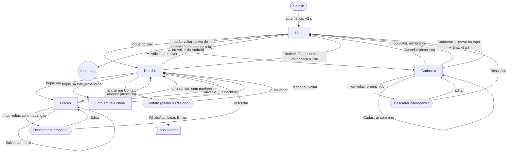

# Navegação

Fluxo entre as telas do app. O diagrama está em [Mermaid](https://mermaid.js.org/) e é desenhado automaticamente pelo GitHub.

**Legenda:** `[ ]` tela · `([ ])` início · `(( ))` fim · `{{ }}` sobreposição (painel ou diálogo) · `> ]` fora do app · seta pontilhada = sai do app.

## Caminhos

| De → Para | Gatilho |
|---|---|
| Splash → Lista | Automático, depois de ~2 s. A splash sai do histórico: voltar nunca retorna a ela |
| Lista → Detalhe | Toque no card |
| Lista → Cadastro | Botão flutuante "＋ Adicionar imóvel" (só com a lista carregada) |
| Cadastro → Lista | Cancelar: descarta direto. Seta ← ou voltar do Android com o formulário **em branco**: volta direto |
| Cadastro → confirmação | Seta ← ou voltar do Android com algo preenchido: "Descartar alterações?" → Descartar (volta à Lista) ou Editar |
| Cadastro → Lista | Cadastrar com sucesso: o novo aparece no **topo**, a Lista rola até ele e mostra "Imóvel cadastrado". Busca e filtro são mantidos se o novo aparece com eles; senão, são limpos e o aviso diz "Imóvel cadastrado. Busca e filtro limpos para mostrá-lo." |
| Cadastro → Cadastro | Cadastrar com erro: permanece na tela, mantendo o que foi digitado |
| Lista → sai do app | Botão voltar nativo do Android. A Lista é a tela inicial: não tem seta de voltar |
| Detalhe → Lista | Seta ← ou botão voltar do Android |
| Detalhe (imóvel não encontrado) → Lista | Botão "Voltar para a lista" |
| Detalhe → Edição | Toque em "Editar" (botão com ícone de lápis e texto) |
| Detalhe → Foto em tela cheia | Toque na foto, **só com ela expandida** (com a barra verde recolhida, não faz nada). A foto "voa" do card ao detalhe e ao visualizador (animação Hero) |
| Foto em tela cheia → Detalhe | ✕ (tooltip "Fechar") ou botão voltar do Android. Zoom por pinça de 1× a 4× |
| Edição → Detalhe | Cancelar: descarta as alterações direto |
| Edição → Detalhe | Seta ← ou voltar do Android **sem** mudanças: volta direto |
| Edição → confirmação | Seta ← ou voltar do Android **com** mudanças não salvas: "Descartar alterações?" → Descartar (volta ao detalhe) ou Editar |
| Edição → Detalhe | Salvar com sucesso, com SnackBar "Imóvel atualizado" |
| Edição → Edição | Salvar com erro: permanece na tela, mantendo o que foi digitado |
| Detalhe → Contato | "Entrar em Contato": painel de baixo (tela estreita) ou diálogo (tela larga) |
| Contato → Detalhe | Fechar ou voltar |
| Contato → app externo | WhatsApp, Ligar ou E-mail |
