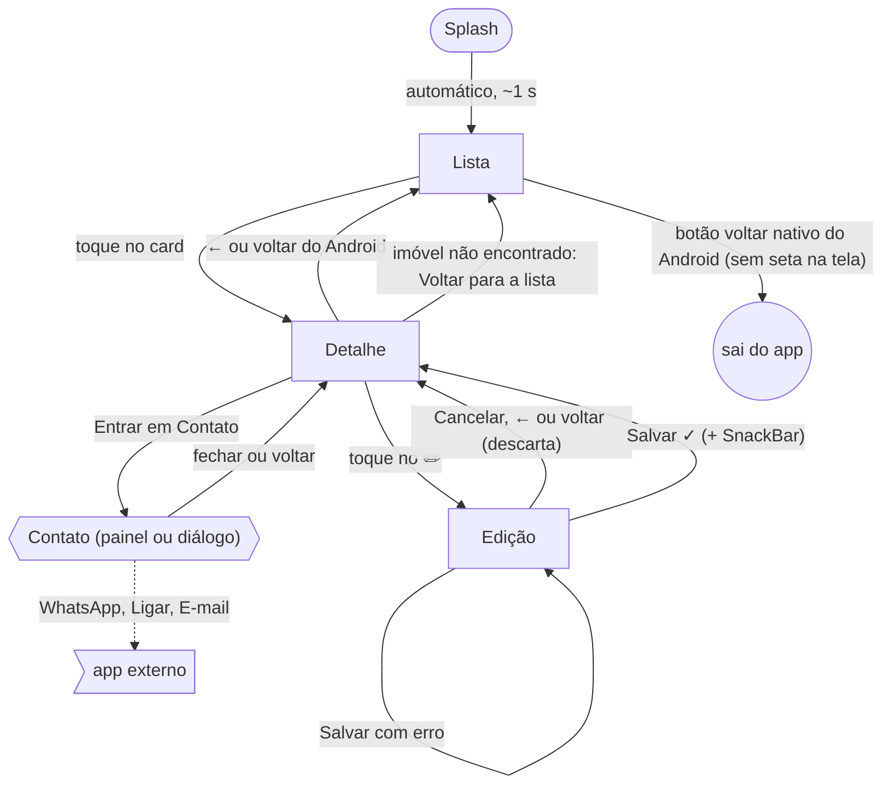

# Navegação

Fluxo entre as telas do app. O diagrama está em [Mermaid](https://mermaid.js.org/) e é desenhado automaticamente pelo GitHub.

**Legenda:** `[ ]` tela · `([ ])` início · `(( ))` fim · `{{ }}` sobreposição (painel ou diálogo) · `> ]` fora do app · seta pontilhada = sai do app.

## Caminhos

| De → Para | Gatilho |
|---|---|
| Splash → Lista | Automático, depois de ~1 s. A splash sai do histórico: voltar nunca retorna a ela |
| Lista → Detalhe | Toque no card |
| Lista → sai do app | Botão voltar nativo do Android. A Lista é a tela inicial: não tem seta de voltar |
| Detalhe → Lista | Seta ← ou botão voltar do Android |
| Detalhe (imóvel não encontrado) → Lista | Botão "Voltar para a lista" |
| Detalhe → Edição | Toque no lápis ✏️ ("Editar imóvel") |
| Edição → Detalhe | Cancelar, seta ← ou botão voltar do Android: descartam as alterações |
| Edição → Detalhe | Salvar com sucesso, com SnackBar "Imóvel atualizado" |
| Edição → Edição | Salvar com erro: permanece na tela, mantendo o que foi digitado |
| Detalhe → Contato | "Entrar em Contato": painel de baixo (tela estreita) ou diálogo (tela larga) |
| Contato → Detalhe | Fechar ou voltar |
| Contato → app externo | WhatsApp, Ligar ou E-mail |
